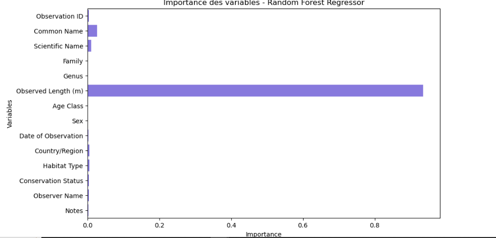

#  Analyse des espèces mondiales de crocodiles

## Aperçu du projet

Ce projet utilise un ensemble de données sur les crocodiles du monde entier afin d'analyser leurs caractéristiques biologiques et géographiques.  
L'objectif est de comprendre la distribution des espèces, de prédire certaines caractéristiques comme la taille adulte ou le poids, et d'identifier les facteurs les plus importants pour la conservation et la gestion des populations.  

Le dataset contient des informations sur :  
- Le type et la classification de l'espèce  
- Les caractéristiques biologiques (taille, poids, âge à maturité)  
- La répartition géographique  
- Les observations enregistrées dans le monde entier

Ce projet permettra de construire des modèles de régression et de classification, d'évaluer leur performance et de fournir des recommandations pratiques pour la conservation des crocodiles.


###  Compréhension du métier (Business Understanding)

*Problématique principale :*  
Comment prédire certaines caractéristiques des crocodiles (taille, poids, classification, etc.) et identifier les facteurs influençant leur distribution dans le monde, afin de soutenir la recherche et la conservation des espèces ?

*Parties prenantes :*  
- Chercheurs et biologistes spécialisés en crocodiles  
- Organisations de protection de la faune  
- Data scientists et analystes de données  

*Objectifs du projet :*  
- Construire des modèles supervisés pour prédire la classification ou des caractéristiques biologiques des crocodiles (régression ou classification).  
- Identifier les facteurs influençant la taille, le poids et la répartition des espèces.  
- Fournir des recommandations exploitables pour la recherche et la conservation.

### Data Understanding

L'objectif de cette étape est de comprendre la structure et le contenu du dataset avant de commencer la préparation et la modélisation.

L'ensemble de données crocodile_dataset.csv contient des informations sur plusieurs espèces de crocodiles dans le monde. Chaque enregistrement inclut :  
- Le type et la classification de l'espèce (genre, espèce, famille)  
- Les caractéristiques biologiques (taille adulte, poids, âge à maturité, etc.)  
- La répartition géographique et habitats naturels  
- Les observations et mesures enregistrées par les chercheurs  
- Les comportements et interactions avec l’environnement  
- Les éventuelles notes ou commentaires des chercheurs  

*Objectifs de l'exploration des données :*  
- Identifier les colonnes *numériques* et *catégorielles*  
- Détecter les *valeurs manquantes ou aberrantes*  
- Comprendre la *distribution des espèces, tailles et poids*  
- Fournir un *premier aperçu des relations entre les variables*, qui guidera la préparation des données et le choix des modèles  

Cette étape permettra de préparer un *jeu de données propre et exploitable* pour la modélisation supervisée (régression ou classification) et pour des analyses exploratoires comme le clustering ou la visualisation géographique.


###  Data Preparation

Cette étape vise à préparer le dataset pour la modélisation supervisée et non supervisée.  

*Étapes réalisées :*  
1. *Nettoyage des données*  
   - Suppression des doublons pour éviter les biais dans les modèles.  

2. *Gestion des valeurs manquantes*  
   - Colonnes numériques : remplissage avec la médiane.  
   - Colonnes catégorielles : remplissage avec la valeur la plus fréquente.  

3. *Transformation des variables*  
   - Conversion des colonnes de type texte ou date en formats exploitables (ex. année de naissance, âge, etc.)  
   - Création de nouvelles features si nécessaire (ex. ratio poids/taille, âge relatif).  

4. *Encodage des variables catégorielles*  
   - Transformation des colonnes telles que Genre, Famille, Habitat en valeurs numériques à l’aide de LabelEncoder ou OneHotEncoder.  

5. *Mise à l’échelle des features numériques*  
   - Standardisation des colonnes comme Taille adulte, Poids, Âge à maturité pour les modèles sensibles à l’échelle (KNN, réseaux neuronaux).  

6. *Séparation des données*  
   - Création des jeux X_train, X_test, y_train, y_test selon la variable cible choisie (ex. classification de l’espèce ou prédiction du poids).  

Cette préparation garantit que les modèles de classification, régression, clustering et analyses avancées puissent être appliqués efficacement et produire des résultats fiables et interprétables.

#  Résumé du code d'importation des bibliothèques

Le code commence par importer toutes les bibliothèques nécessaires pour :

---

##  1. Manipuler les données
- *pandas* : pour charger, transformer et analyser les données tabulaires.  
- *numpy* : pour les calculs numériques et la manipulation de tableaux.

---

##  2. Visualiser les résultats
- *matplotlib* : pour créer des graphiques simples (courbes, barres, histogrammes).  
- *seaborn* : pour des visualisations plus esthétiques et avancées (heatmaps, boxplots, corrélations).

---

##  3. Préparer et entraîner des modèles de Machine Learning
- *train_test_split* : séparer le dataset en un ensemble d’entraînement et un ensemble de test.  
- *LabelEncoder* : transformer les variables catégorielles en valeurs numériques.  
- *StandardScaler* : normaliser les données pour rendre les variables comparables.  

- *RandomForestClassifier / Regressor* : modèles d’arbres de décision robustes pour classification et régression.  
- *KNeighborsClassifier / Regressor* : algorithme basé sur la proximité des points (k plus proches voisins).  

- *GridSearchCV / RandomizedSearchCV* : optimisation des hyperparamètres des modèles.

---

##  4. Évaluer les performances des modèles
- *Classification* :  
  - accuracy_score  
  - precision_score  
  - recall_score  
  - f1_score  
  - confusion_matrix  
  - classification_report  

- *Régression* :  
  - mean_squared_error (MSE)  
  - r2_score (coefficient de détermination)

 ```python
# =========================
# Import des librairies
# =========================
import pandas as pd
import numpy as np
import matplotlib.pyplot as plt
import seaborn as sns

# Machine Learning
from sklearn.model_selection import train_test_split, GridSearchCV, RandomizedSearchCV
from sklearn.preprocessing import LabelEncoder, StandardScaler
from sklearn.ensemble import RandomForestClassifier, RandomForestRegressor
from sklearn.neighbors import KNeighborsClassifier, KNeighborsRegressor
from sklearn.metrics import accuracy_score, precision_score, recall_score, f1_score, confusion_matrix, classification_report, mean_squared_error, r2_score

```


#  Lecture du dataset

Le code permet de charger et d’avoir un premier aperçu des données.

---

##  1. Chargement du dataset
```python
# =========================
data = pd.read_csv("crocodile_dataset.csv")

# Affichage des premières lignes
data.head(10)

```


#  Nettoyage des doublons

Le but est de vérifier si certaines lignes du dataset sont présentes plusieurs fois et, si c’est le cas, de les supprimer afin d’éviter les biais dans l’analyse.

---

##  1. Vérification du nombre de doublons
```python
# Nettoyage des doublons
# =========================
print("Nombre de doublons :", data.duplicated().sum())

# Suppression des doublons
data = data.drop_duplicates()

# Vérification
print("Nouvelle dimension du dataset :", data.shape)

```

#  Gestion des valeurs manquantes

L’objectif est de traiter les valeurs manquantes (NaN) dans le dataset afin de garantir la qualité des analyses et d’éviter les erreurs lors de l’entraînement des modèles.

---

##  1. Identification des colonnes numériques
```python
# =========================
#Gestion des valeurs manquantes
# =========================

# Colonnes numériques
numeric_cols = data.select_dtypes(include=['float64','int64']).columns
for col in numeric_cols:
    data[col] = data[col].fillna(data[col].median())

# Colonnes catégorielles
categorical_cols = data.select_dtypes(include=['object']).columns
for col in categorical_cols:
    data[col] = data[col].fillna(data[col].mode()[0])

# Vérification
print("Valeurs manquantes par colonne après traitement :")
print(data.isnull().sum())

```

#  Encodage des variables catégorielles

Les algorithmes de Machine Learning ne peuvent pas directement traiter les *données textuelles* (ex. : Male, Female, Forest, River).  
Il faut donc convertir les colonnes *catégorielles* en *valeurs numériques* à l’aide d’un encodage.

---

##  1. Création d’un encodeur
```python
# =========================
#  Encodage des variables catégorielles
# =========================

le = LabelEncoder()
for col in categorical_cols:
    data[col] = le.fit_transform(data[col])

# Vérification
data[categorical_cols].head()

```

#  Normalisation des colonnes numériques

Les variables numériques du dataset (ex. : Observed Length (m), Observed Weight (kg), Age Class) n’ont pas la même *échelle*.  
- Exemple : la longueur est en *mètres* (valeurs proches de 1–6) alors que le poids est en *kg* (valeurs proches de 100–1000).  
- Certains algorithmes de Machine Learning (comme KNN, SVM, Régression Logistique) sont sensibles à ces différences d’échelles.  

Pour éviter qu’une variable domine les autres, on applique une *normalisation*.

---

##  1. Création d’un standardiseur
```python
#  Normalisation des colonnes numériques
# ===============================
scaler = StandardScaler()
data[numeric_cols] = scaler.fit_transform(data[numeric_cols])
print(data[numeric_cols].head())

```

#  Exemple : Classification pour prédire le statut de conservation

L’objectif de cette étape est de préparer les données pour un modèle de *classification* qui prédit le Conservation Status (par ex. : Endangered, Vulnerable, Least Concern, etc.) en fonction des caractéristiques biologiques et environnementales.

---

##  1. Définition de la cible
```python
# Exemple : classification pour prédire le statut de conservation
target_col = 'Conservation Status'
X = data.drop(target_col, axis=1)
y = data[target_col]

# Vérification des dimensions
print("X shape :", X.shape)
print("y shape :", y.shape)

```

#  Séparation des données : Train/Test

L’objectif est de diviser le jeu de données en deux parties :  
- *Train (entraînement)* : utilisé pour apprendre le modèle.  
- *Test (évaluation)* : utilisé pour mesurer la performance du modèle sur des données jamais vues.

---

##  Code utilisé
```python
from sklearn.model_selection import train_test_split

X_train, X_test, y_train, y_test = train_test_split(
    X, y, test_size=0.2, random_state=42, stratify=y
)

print("X_train :", X_train.shape, "X_test :", X_test.shape)
print("y_train :", y_train.shape, "y_test :", y_test.shape)

```

#  Entraînement d'un modèle Random Forest

L'objectif est de créer un modèle de *classification* pour prédire le statut de conservation des crocodiles à partir des variables du dataset.

---

##  Code utilisé
```python
from sklearn.ensemble import RandomForestClassifier

rf = RandomForestClassifier(random_state=42)
rf.fit(X_train, y_train)

# Prédictions
y_pred = rf.predict(X_test)

```

#  Évaluation du modèle Random Forest

Après l'entraînement et les prédictions, il est crucial de *mesurer la performance* du modèle sur les données de test.

---

##  Code utilisé
```python
from sklearn.metrics import accuracy_score, classification_report, confusion_matrix
import seaborn as sns
import matplotlib.pyplot as plt

# Accuracy
print("Accuracy :", accuracy_score(y_test, y_pred))

# Rapport complet
print("Classification Report :\n", classification_report(y_test, y_pred))

# Matrice de confusion
cm = confusion_matrix(y_test, y_pred)
plt.figure(figsize=(6,5))
sns.heatmap(cm, annot=True, fmt="d", cmap="Blues")
plt.xlabel("Predicted")
plt.ylabel("Actual")
plt.title("Matrice de confusion - Random Forest")
plt.show()

```


<p style='text-align: center; font-style: italic; color: #7f8c8d;'>
</p>


#  Importance des variables - Random Forest

Après l'entraînement d'un modèle Random Forest, il est possible d'identifier quelles variables ont le plus contribué aux prédictions.

---

##  Code utilisé
```python
importances = rf.feature_importances_
features = X_train.columns

plt.figure(figsize=(10,6))
plt.barh(features, importances, color='mediumseagreen')
plt.title("Importance des variables - Random Forest")
plt.xlabel("Importance")
plt.ylabel("Variables")
plt.show()

```


<p style='text-align: center; font-style: italic; color: #7f8c8d;'>
</p>

#  Optimisation du modèle Random Forest avec RandomizedSearchCV

Pour améliorer les performances du modèle Random Forest, nous utilisons *RandomizedSearchCV* pour tester différentes combinaisons d’hyperparamètres.

---

##  Code utilisé
```python
from sklearn.model_selection import RandomizedSearchCV

param_grid = {
    'n_estimators': [100, 200, 300],
    'max_depth': [5, 10, 15, None],
    'min_samples_split': [2, 5, 10],
    'min_samples_leaf': [1, 2, 4],
    'max_features': ['sqrt', 'log2', None]  
}
random_search = RandomizedSearchCV(
    estimator=rf,
    param_distributions=param_grid,
    n_iter=20,
    cv=3,
    scoring='f1_weighted',
    n_jobs=-1,
    verbose=1,
    random_state=42
)

random_search.fit(X_train, y_train)
print("Meilleurs paramètres :", random_search.best_params_)

best_rf = random_search.best_estimator_
y_pred_best = best_rf.predict(X_test)

```


#  Visualisation des distributions par statut de conservation

Nous utilisons des *boxplots* pour explorer comment les longueurs et poids observés des crocodiles varient selon leur *statut de conservation*.

---

##  Code utilisé
```python
# Distribution des longueurs par statut de conservation
plt.figure(figsize=(12,5))
sns.boxplot(x=data['Conservation Status'], y=data['Observed Length (m)'])
plt.title("Distribution des longueurs par statut de conservation")
plt.show()

# Distribution des poids par statut de conservation
plt.figure(figsize=(12,5))
sns.boxplot(x=data['Conservation Status'], y=data['Observed Weight (kg)'])
plt.title("Distribution des poids par statut de conservation")
plt.show()

```


<p style='text-align: center; font-style: italic; color: #7f8c8d;'>
</p>


<p style='text-align: center; font-style: italic; color: #7f8c8d;'>
</p>


#  Préparation des données pour la régression

Nous voulons prédire le *poids observé* (Observed Weight (kg)) des crocodiles à partir des autres caractéristiques.

---

##  Code utilisé
```python
# Target pour régression
target_col_reg = 'Observed Weight (kg)'
X_reg = data.drop(target_col_reg, axis=1)
y_reg = data[target_col_reg]

# Encodage des colonnes catégorielles
categorical_cols = X_reg.select_dtypes(include=['object']).columns
le = LabelEncoder()
for col in categorical_cols:
    X_reg[col] = le.fit_transform(X_reg[col].astype(str))

# Standardisation des colonnes numériques
numeric_cols = X_reg.select_dtypes(include=['int64','float64']).columns
scaler = StandardScaler()
X_reg[numeric_cols] = scaler.fit_transform(X_reg[numeric_cols])

# Séparation Train/Test
X_train_reg, X_test_reg, y_train_reg, y_test_reg = train_test_split(
    X_reg, y_reg, test_size=0.2, random_state=42
)

print("X_train_reg :", X_train_reg.shape, "X_test_reg :", X_test_reg.shape)

```

#  Modélisation de la régression

Nous utilisons un *Random Forest Regressor* pour prédire le *poids observé* des crocodiles à partir des caractéristiques du dataset.

---

##  Code utilisé
```python
rf_reg = RandomForestRegressor(random_state=42)
rf_reg.fit(X_train_reg, y_train_reg)

# Prédictions
y_pred_reg = rf_reg.predict(X_test_reg)

```

#  Évaluation du Random Forest Regressor

Nous évaluons les performances du modèle de régression en utilisant *RMSE* et *R²*.

---

##  Code utilisé
```python
from sklearn.metrics import mean_squared_error, r2_score, root_mean_squared_error

# Calcul du RMSE et R²
rmse = root_mean_squared_error(y_test_reg, y_pred_reg)
r2 = r2_score(y_test_reg, y_pred_reg)

print("RMSE :", rmse)
print("R² :", r2)

```

#  Importance des variables - Random Forest Regressor

Cette section permet de comprendre quelles variables ont le plus d’influence sur la prédiction du *poids observé des crocodiles*.

---

##  Code utilisé
```python
importances_reg = rf_reg.feature_importances_
features_reg = X_train_reg.columns

plt.figure(figsize=(10,6))
sns.barplot(
    x=importances_reg,
    y=features_reg,
    orient='h',
    color="mediumslateblue"  # couleur unique pour la lisibilité
)
plt.title("Importance des variables - Random Forest Regressor")
plt.xlabel("Importance")
plt.ylabel("Variables")
plt.show()

```


<p style='text-align: center; font-style: italic; color: #7f8c8d;'>
</p>


#  Explicabilité avec SHAP - Random Forest Regressor

Cette section montre **comment chaque variable influence les prédictions** du modèle Random Forest pour le poids observé des crocodiles.

---

##  Code utilisé
```python
import shap

# Création de l'explainer
explainer = shap.TreeExplainer(rf_reg)
shap_values = explainer.shap_values(X_test_reg)

# Visualisation résumée (bar plot)
shap.summary_plot(shap_values, X_test_reg, plot_type="bar")

# Visualisation détaillée (summary plot classique)
shap.summary_plot(shap_values, X_test_reg)

```


<p style='text-align: center; font-style: italic; color: #7f8c8d;'>
</p>


<p style='text-align: center; font-style: italic; color: #7f8c8d;'>
</p>


#  Visualisations exploratoires

Cette étape permet de *comprendre la distribution et les relations* entre les variables clés du dataset crocodile.

---

## Longueur vs Poids selon le statut de conservation

```python
plt.figure(figsize=(12,5))
sns.scatterplot(
    x=data['Observed Length (m)'], 
    y=data['Observed Weight (kg)'], 
    hue=data['Conservation Status']
)
plt.title("Longueur vs Poids selon le statut de conservation")
plt.show()


```


<p style='text-align: center; font-style: italic; color: #7f8c8d;'>
</p>
 
